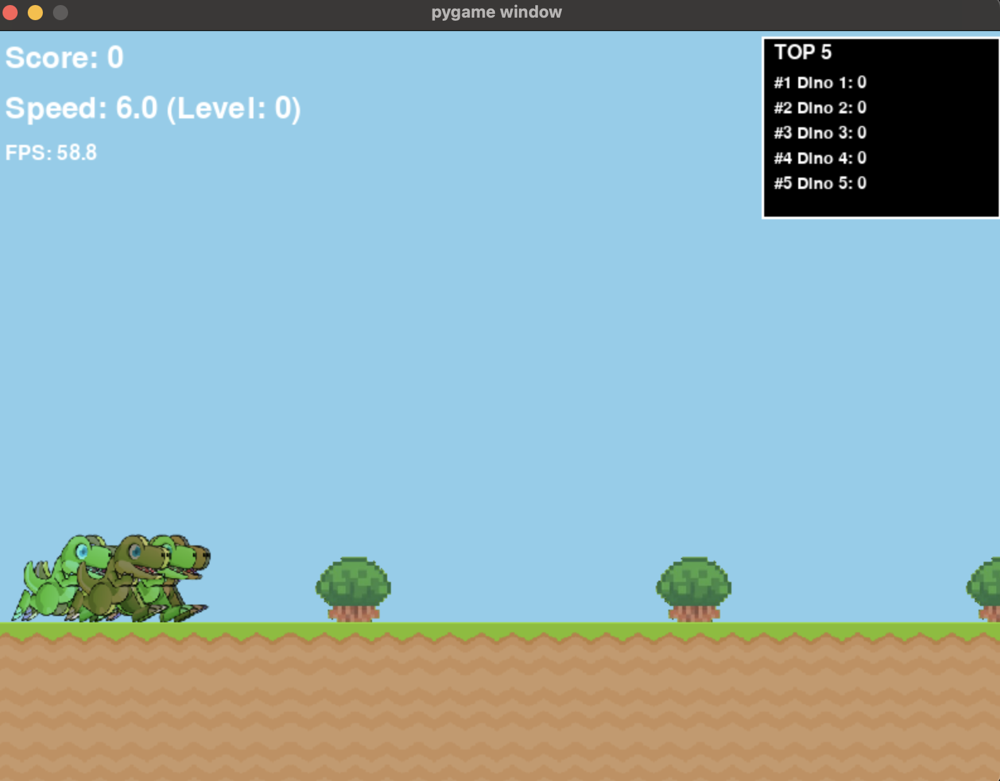

# 🦖 Dino Game

A Python-based dino running game inspired by Chrome's offline game, developed to practice Python programming skills and explore machine learning concepts.



## 🎮 Features

- **Multi-Dino Support**: Control multiple dinosaurs simultaneously
- **Dynamic Scoring System**: Real-time score tracking with top 5 leaderboard
- **Progressive Difficulty**: Game speed increases as you progress

## 🚀 Installation

### Setup

1. Clone the repository:

```bash
git clone https://github.com/yourusername/dino.git
cd dino
```

2. Install dependencies:

```bash
pip install -r requirements.txt
```

3. Run the game:

```bash
python main.py
```

## 🎯 How to Play

### Controls

- **Space/Up Arrow**: Jump
- **Down Arrow**: Duck (when falling)

### Scoring

- Earn 1 point for each obstacle successfully avoided
- Game speed increases every 30 points
- Top 5 scores are displayed in real-time
